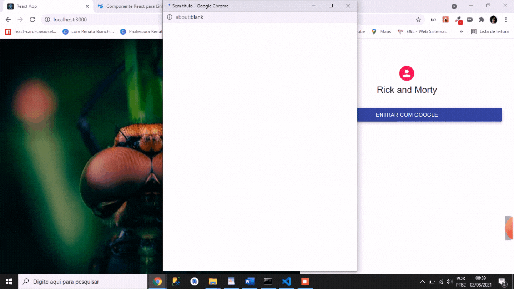

Sistema que visa capturar informações do desenho Rick and Morty por meio de uma [api](: https://rickandmortyapi.com/documentation/#introduction), listar todos os personagens na página principal, adicionar ou remover personagens favoritos. 
 
 

 Nessa aplicação foram trabalhados vários conceitos: 

<ul>
    <li> Organização </li>
    <li> Arquitetura </li>
    <li> Coesão e Clareza </li>
    <li> Documentação - Instruções claras para execução Versionamento (Git) </li>
    <li> Testes </li>
    <li> Consumo de uma API RESTful </li>
    <li> Estruturação dos componentes </li>  
</ul>

# REQUISITOS
-Deve-se criar uma aplicação React com Typescript de uma única página onde possamos:
-Buscar um personagem pelo o nome;
-Visualizar o feedback de loading enquanto a API não responde;
-Exibir mensagem de erro caso o personagem não exista;
-Exibir informações mínimas sobre o(s) personsagem(ns) caso ele(s) exista(m);
-Registrar o personagem na lista de favoritos utilizando alguma biblioteca de controle de estado global ou a Context API nativa do React;
-Visualizar a lista de personagens favoritos;
-Excluir personagem da lista;
-Responsividade

# HISTÓRIAS DE USUÁRIO
1. Buscar personagem
2. Ao pesquisar um personagem, gostaria de ver nome, genero e sua foto(se existir) antes de decidir favoritá-lo.
3. Ao pesquisar um personagem, gostaria de salvá-lo para que fique listado nos meus favoritos.
4. Ao pesquisar um um personagem que não existe, gostaria de ser avisado que ele não existe.

As principais ferramentas foram *Typescript, React, Firebase, MaterialUI* 

  

# Instalar as dependências

### `yarn add`

# Para rodar o projeto: 

### `yarn start`

